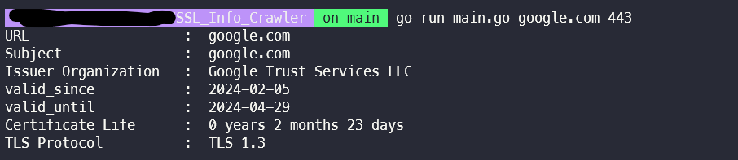
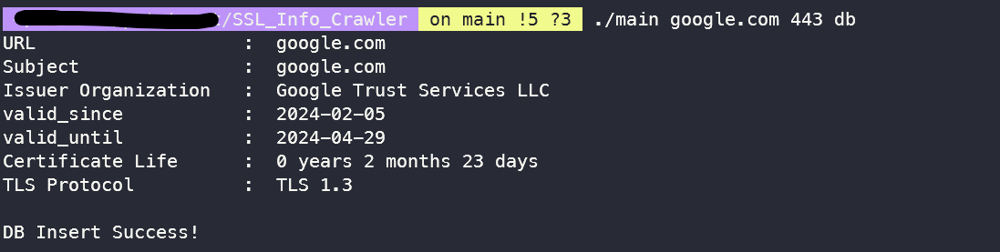

# SSL INFO CRAWLER

This crawler crawling SSL certificate information about some url by TLS.
<br><br>

# USAGE

😅Usage &nbsp;&nbsp;&nbsp;&nbsp;: &nbsp;&nbsp;`go run main.go &#60;url> &#60;port>` <br>
🤔Example &nbsp;: &nbsp; `go run main.go google.com 443`

## Connect DB

If you also want to store it in the database, you'll need to create a dbConfig.env file under config to store information related to the database connection.

```
# dbconfig.env example
DB_USER= root
DB_PASSWORD= your_password
DB_NETWORK=tcp
DB_ADDRESS= your_ip:3306
DB_NAME= your_db_name
```

Then, when you run it, give it the following options

🤔Example with DB &nbsp;: &nbsp; `go run main.go google.com 443 db`
<br><br>

# EXAMPLE




