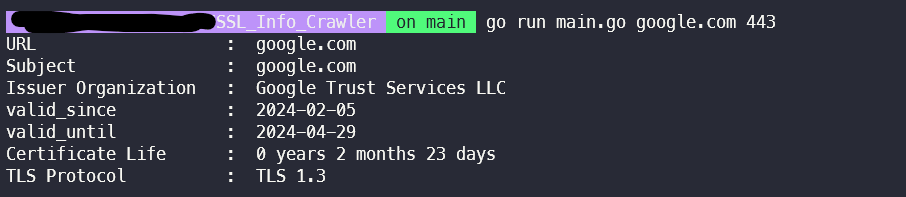

# SSL INFO CRAWLER

This crawler crawling SSL certificate information about some url by TLS.
  

# USAGE

😅Usage &nbsp;&nbsp;&nbsp;&nbsp;: &nbsp;&nbsp;go run main.go &#60;url> &#60;port>  
🤔Example &nbsp;: &nbsp; go run main.go www.google.com 443
  

# EXAMPLE

